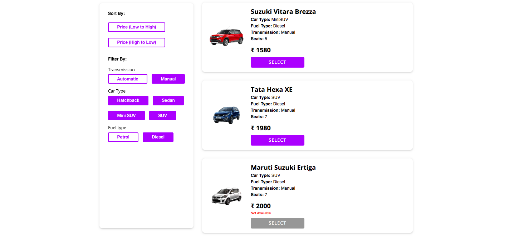
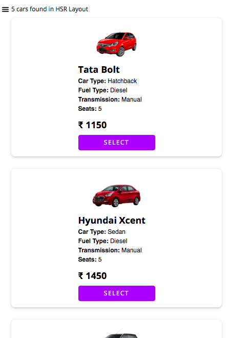
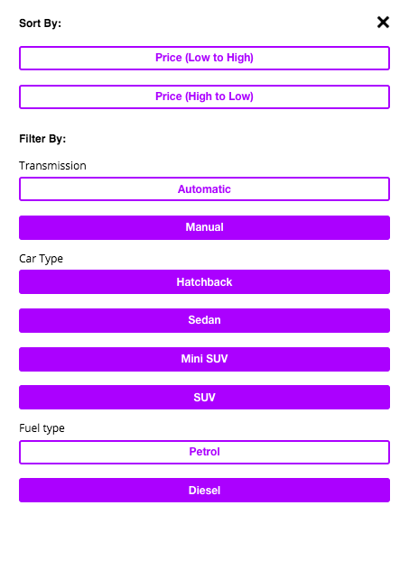

# README #

Basic sort and filter of a car rental app

### Summary ###

* Built on react boilerplate. Please ignore most of the scaffolding code.
* App, HomePage, CarList and CarItem are the components of interest.
* Simply `npm install`, `npm start` and point to `localhost:3000`.
* Both SCSS and `styled-components` are used. Global styleguide has some reusuable CSS rules.
* Redux used for state management.

### Screenshots ###

